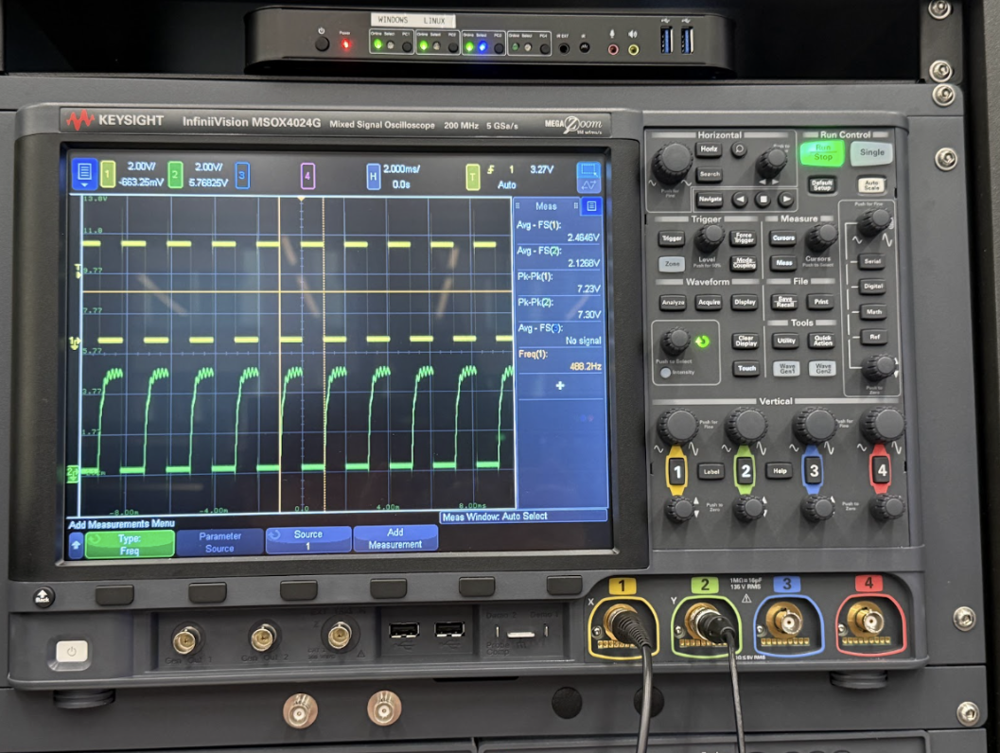
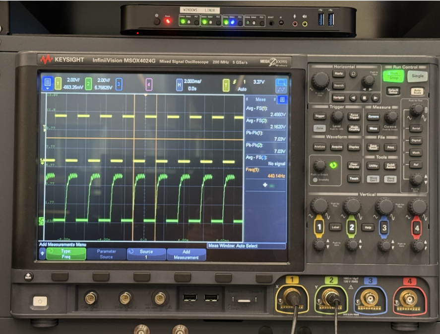
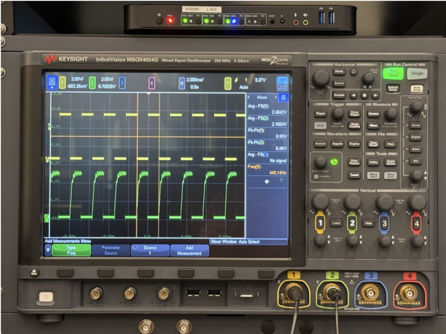
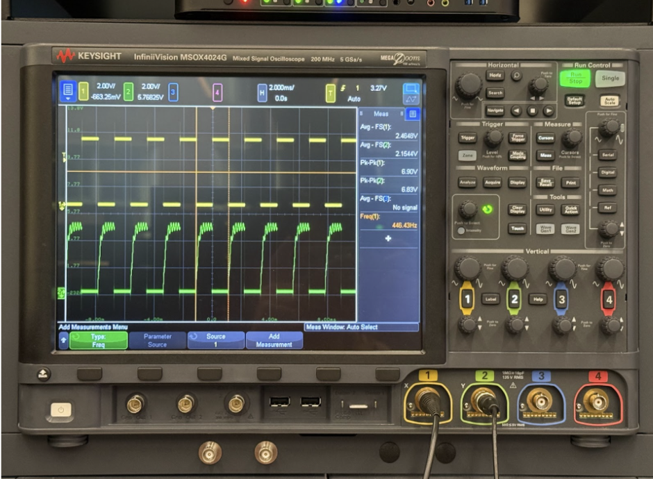
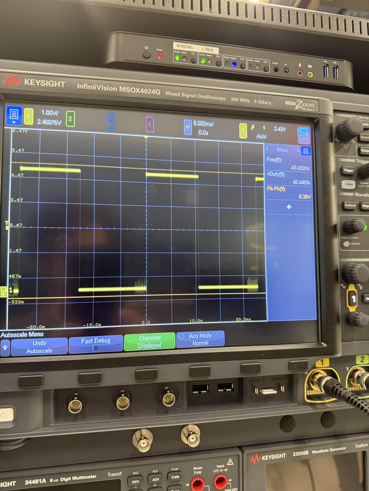
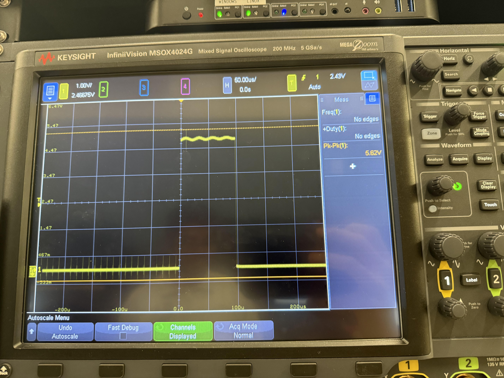
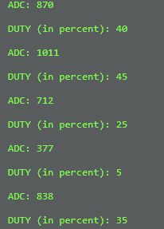

# ESE3500_Lab3_Temp

# Timer Overflow 
## (R1) What frequency is being generated here? Is it what you expected? Show your work.
The frequency being generated is 488Hz as shown in the scope image. This is exactly the frequency that we expected since we're using the 8-bit timer0 with a prescale of 64. Thus, f_desired = 16MHz/2 * 64 * 256 = 488Hz. 

## (I1)	Attach an image from the oscilloscope showing both waveforms.

# Normal Mode
## (R2)	Did you have to prescale the system clock and/or timer clock? If so, by how much?
We did not have to prescale the system clock since we know from R1 that generating a frequency in the 400Hz range is possible by only using a timer prescalar. We prescaled the timer clock by 256 this time and relied on output compare to get it to exactly 440Hz. 

## (R3) What number should OCR0A be in this case? 
We set OCR0A = 70, derived from the formula count = 16MHz/(2 * 256 * 440Hz) - 1 = 70.

## (S1)	Attach a screenshot of your code snippet or copy & paste the snippet into a box in the submission document. It should be quite short.

''

    //LAB 3 - PART 2 
    void Initialize() {
        //configrue output LED to PD6
        DDRD |= (1 << PD6);
        DDRB |= (1 << LED_PIN); 

        //set the prescale to 255 
        TCCR0B |= (1 << 2); 
        TCCR0B &= ~(1 << 0);
        TCCR0B &= ~(1 << 1); 
        
        TIMSK0 |= (1 << OCIE0A); 
        
        //SET timer control A to normal mode
        TCCR0A &= ~(1 << 0); 
        TCCR0A &= ~(1 << 1); 
        TCCR0A &= ~(1 << 2); 

        //set the OCR0A Value: 
        OCR0A = 70; 
        //Set the interrupt: 
        TIFR0 |= (1 << OCF0A); 

        sei(); 
        uart_init(); 
    }

    ISR(TIMER0_COMPA_vect){
        PORTD ^= (1 << PORTD6);
        TCNT0 = 0; 
        OCR0A = 70; 
    }

    int main(void) {
        Initialize(); 
        while (1) {
        }
        return 0; 
    }

''

## (I2)	Attach an image from the oscilloscope showing both waveforms.

# CTC Mode

## (R4)	What number should OCR0A be in this case? 
OCR0A should still be 70 (same as Part 2) 
## (S2)	Attach a screenshot of your code snippet.
''

    void Initialize() {
        
        // set PD6 (OC0A) as output
        DDRD |= (1 << PD6);

        //set the CTC mode
        TCCR0A = (1 << 1); 

        //toggle OCRA on compare match
        TCCR0A |= (1 << COM0A0); 

        
        OCR0A = 70; 

        //prescaler
        TCCR0B |= (1 << CS02); 

        sei(); 
    }

    int main(void) {
        Initialize(); 
        while (1) {
        }
        return 0; 
    } 

''

## (I3)	Attach an image from the oscilloscope showing both waveforms.

# PWM Mode
# (R5)	What number should OCR0A be in this case? Specify which Phase Correct mode you use - namely, what is the TOP value? (Refer to Table 18-9 in the datasheet). 
OCR0A should be 35 this time, since we compare both when we count up and when we count down. Twice the compare means 1/2 the count. We used mode 5 in the datasheet with TOP = OCR0A. 

# (S3)	Attach a screenshot of your code snippet.

''

    //LAB 3 - Part  - Phase Correct
    void Initialize() {

        // set PD6 (OC0A) AND PD5 (OC0B) as outputs
        DDRD |= (1 << PD6) | (1 << PD5);

        // phase Correct PWM (mode 5 in the data sheet) (TOP = OCR0A)
        TCCR0A = (1 << WGM00); 
        TCCR0B = (1 << WGM02);

        // configure compare match output mode: 
        // OC0A: toggle on match
        // OC0B: Non-inverting PWM 
        TCCR0A |= (1 << COM0A0) | (1 << COM0B1);

        // set frequency and duty cycle
        OCR0A = 35;                // Freq (top = 35)
        OCR0B = OCR0A / 2;         // duty cycle == 0.5

        // prescale by 256 (which starts the timer)
        TCCR0B |= (1 << CS02); 

        sei(); 
    }

    int main(void) {
        Initialize(); 
        while (1) {
        }
        return 0; 
    } 

''

# (I4)	Attach an image from the oscilloscope showing both waveforms.

## Part C: Measuring Distance

# (R6)	Reading through the datasheet (and another relevant datasheet of HC-SR04), what is the length or duration of the pulse that needs to be supplied to start the ranging?

The pulse needs to be at least 10 micro seconds (10us) in order to trigger the ultrasonic sensor detection. 

# (R7)	What are the Trig and Echo pins used for?  
The the Trig pin is used to start the sensing for the ultrasonic sensor (we drive it high for 10 microseconds to start the sensing). The Echo pin is used to read the sensors outuput (the duration that echo is on correlates to the distance). 

# (R8)	What is the largest distance (in cm) that you observed printed out in the terminal?

ANSWER: 176.6 cm

We had 162 ticks... 

Lets convert the ticks to seconds. Note that we were using a 16-bit timer with as 1024-prescale. So 65535 ticks takes 65535/16000000 = 0.0041 * 1024 = 4.1984 seconds per cycle. 

We have 736 ticks so the total time was: 
(162/65535) * (4.1984) = 0.0103 seconds

Now to calculate: 
0.0103 seconds * (343 m/s) / 2 = 1.76645 meters = 176.6 cm

(Note this is largest STABLE signal we could get since the room is very noisy in terms of object distance). 

# (I5)	Attach an image from the oscilloscope showing (about) the most significant distance.

# (R9)	What is the smallest distance (in cm) that you observed printed out in the terminal?
ANSWER: 2.19 cm

We had 2 ticks... 

Lets convert the ticks to seconds. Note that we were using a 16-bit timer with as 1024-prescale. So 65535 ticks takes 65535/16000000 = 0.0041 * 1024 = 4.1984 seconds per cycle. 

We have 2 ticks so the total time was: 
(2/65535) * (4.1984) = 0.00013 seconds

Now to calculate: 
0.00013 seconds * (343 m/s) / 2 = .0219 meter = 2.19 cm

# (I6)	Attach an image from the oscilloscope showing (about) the smallest distance.

# Code for Ref:  
''

    //LAb 3 - Part C.
    void Initialize() {    
        //Configure da pins ty shi
        DDRB |= (1 << LED_PIN);
        DDRD |= (1 << PD6);
        DDRD &= ~(1 << PD5);
        DDRB &= ~(1 << PB0);

        //Edge settings:
        TCCR1B |= (1 << 6);

        //interrupt enabled:
        TIMSK1 |= (1 << 5);    
    
        // Clear prescaler bits first
        TCCR1B &= ~((1 << CS12) | (1 << CS11) | (1 << CS10));

        // Set prescaler to 1024 (CS12=1, CS11=0, CS10=1)
        TCCR1B |= (1 << CS12) | (1 << CS10);  
    
        sei();
    }

    static volatile int send = 1;

    ISR(TIMER1_CAPT_vect) {
        if (TCCR1B & (1 << 6)) {      
        TCCR1B &= ~(1 << 6);
        send = 0;
        TCNT1 = 0 ;
        } else {
        TCCR1B |= (1 << 6);
        uint16_t val = TCNT1;
        printf("READ: %u\r\n", val);
        send = 1;
        }
    }

    int main(void) {
    printf("socoboo\r\n");
    Initialize();
        uart_init();
        while (1) {      
            if (send) {
                PORTD |= (1 << PD6);  
                _delay_us(10);        // 10 microsecond delay
                PORTD &= ~(1 << PD6);
            }
        }
        return 0;
    }

''

## Part D: Generating Different Tones

# (R10)	Fill in the table below with the correct OCR0A values that will yield the required frequency. You will have to choose a prescaler that will allow for the entire range to be generated with just one timer. Rounding errors are expected. Specify the timer frequency, waveform generation mode, and output compare mode (if any) used.

From the Slides we know: 
Count = ( (f_clk) / (2 * N * f_d) )  - 1 

We will use CTC mode, with a timer prescalar of 64 in order to ensure we do not overflow our OCR0A. 

| Note      |  C6  |  D6  |  E6  |  F6  |  G6  |  A6  |  B6  |  C7  |
|-----------|:----:|:----:|:----:|:----:|:----:|:----:|:----:|:----:|
| Freq (Hz) | 1046 | 1174 | 1318 | 1397 | 1568 | 1760 | 1975 | 2093 |
| OCR0A     | 120  | 106  |  95  |  89  |  80  |  71  |  63  |  59  |
|           |      |      |      |      |      |      |      |      |

# (R11)	Write your linear formula here. It should look something like: OCR0A = SENSOR_VALUE * SOME_RATIO + SOME_NUMBER

Our minimum and maximum (clean) tick counts for echo are 2 and 162 respectively. Additionally, our PWN range for OCR0A is min = 59, max = 120. 

So naturally, we will linearly interpolate the notes relative to the distance as follows: 

OCR0A = (num_ticks / 162) * 61 + 59

# (C1)	Save this code as part_d1.c
Check files. 

# (C2)	Save this code as part_d1.c
Check files.

# (R12)	What are the maximum and minimum ADC values read?
1006 maximum, 244 minimum 

# (R13)	Fill in the table below with your ADC ranges. R12 gives you the minimum and maximum values from your sensor to help you divide evenly across the usable range.

| ADC Ranges | Duty Cycle |  
|:----------:|:----------:|
|    <320    |     5%     | 
|   321-396  |     10%    |  
|   397-472  |     15%    |      
|   473-548  |     20%    |   
|   549-624  |     25%    |   
|   625-700  |     30%    |   
|   701-776  |     35%    |     
|   777-852  |     40%    |     
|   853-928  |     45%    |     
|    >928    |     50%    |    

# (C3)	Save the code in part_e.c
Check files

# (S4)	Take a screenshot of your terminal with varying outputs printed out.

# (R14)	Draw your final circuit and attach an image. This can be done digitally (Circuit Lab, Altium, LTSpice, etc.) or by hand - just ensure it’s clear and complete.

# (C4)	Submit your file as part_f.c
Check files 

# (T1)	Meet with a teaching team member for a demo + quick explanation of the content below. 
